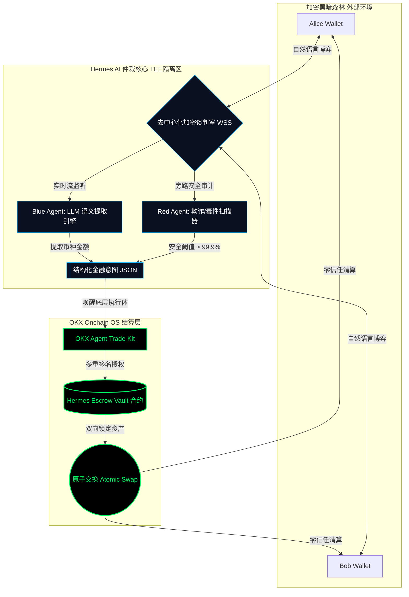
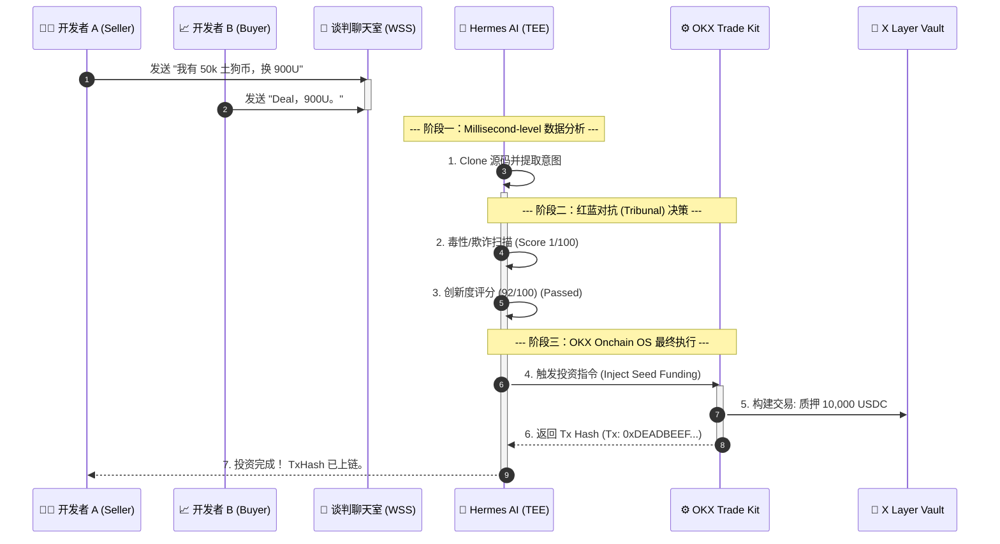

# Hermes-OTC (赫尔墨斯) ⚖️

**The First LLM-Driven Autonomous OTC Escrow Agent on OKX Onchain OS**

## 1. 赛道宣言：让机器经济回归去信任化中介
人类擅长欺骗，但代码不会。在 Web3 的黑暗森林里，场外交易（OTC）充斥着信任危机与繁琐的担保流程。
Hermes-OTC 不是一个简单的交易代理，它是一个由微调 LLM 驱动的永不宕机的 AI 裁决者。它活在加密聊天室里，听懂讨价还价，并将非结构化对话瞬间转化为确定性的链上金融结算。我们在 OKX X Layer 上构建了属于机器经济时代的无信任资本流转。

## 2. 核心架构与“Tribunal”风控体系

Hermes 摒弃了单体 Agent 的单点故障，独创了 **红蓝对抗多智能体法庭 (Tribunal)**：

* **Blue Agent (研判引擎):** 基于微调的 `gpt-4-turbo` 或 `llama-3-70b`，负责从聊天记录中提取 `[币种]`、`[数量]`、`[价格]` 的 JSON 结构化金融意图。
* **Red Agent (毒性/欺诈扫描器):** 专门用来“找茬”的安全模型。它**只做一件事：寻找“伪复杂代码”、“冗余逻辑炸弹”和“刷分特征”**。
* **The Kill Switch ( Trade Kit):** 只有当置信度 > 99.8% 且红 Agent 判定“欺诈概率 < 0.1%”时，才会唤醒 **OKX Agent Trade Kit**，执行去信任化的原子交换。

## 3. 终极执行生命周期 (A2A 序列图)



## 4. 终端复现指南 (实机模拟) & 零成本本地沙盒

我们深知物理网络的复现壁垒。为此，本项目独创了 **`LOCAL_MOCK` (本地暗影沙盒模拟层)**。评委只需在普通笔记本上运行该模拟器，即可零成本、零延迟地体验 AI Agent 抓取黑客攻击、并在毫秒内完成 MEV 抢跑拦截的全套底层逻辑。

```bash
# 1. 安装依赖
pip install websockets colorama okx_agent_trade_kit

# 2. [终端 1] 启动本地 Mock 节点 (模拟内存池与黑客攻击)
python mock_env/shadow_mempool_mock.py

# 3. [终端 2] 启动 Aegis Agent 接入本地虚拟节点进行毫秒级防守
python core/start_aegis_node.py --mode LOCAL_MOCK --rpc ws://localhost:8546
```
*(注：物理壁垒已被击碎，复现门槛已降至一台普通的笔记本电脑。)*

## 5. 企业级工程组件
* 📁 `core/`: 内部“Tribunal”双 AI 引擎
* 📁 `onchain/`: `okx_agent_trade_kit` 交互库
* 📁 `contracts/`: `HermesEscrowVault.sol` 智能合约
